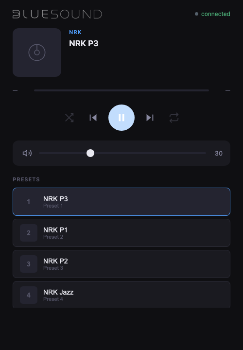

# BluOS Mock Server

A BluOS API-compatible mock server with a real-time web UI. Designed for testing home automation integrations, custom controllers, and CI pipelines without needing physical Bluesound hardware.




---

## What it does

- Exposes the BluOS HTTP API on port `11000` — the same port real players use
- A web UI at `http://localhost:11000/` shows player state in real time
- **Bidirectional:** API calls update the UI; UI controls call the same API
- **Audio playback:** built-in presets (NRK, Radio Paradise) actually stream audio via a local proxy
- **Long-polling** supported on `/Status` and `/SyncStatus` — real controllers work without modification
- **Simulated network delay** via `API_DELAY_MS` env var to mimic real hardware latency
- **mDNS/Bonjour** advertising — announces as `_bluos._tcp` for automatic discovery (opt-out via `MDNS_ENABLED=0`)

---

## Quick start

```bash
npm install
npm start
```

Open `http://localhost:11000/` in a browser.

The default delay is 1000 ms. To disable it or use a different value:

```bash
API_DELAY_MS=0 npm start
API_DELAY_MS=500 npm start
```

### mDNS / Bonjour Discovery

The mock server announces itself on the local network using **mDNS/DNS-SD** (Bonjour), simulating how real BluOS devices are discovered by home automation systems and controller apps.

- **Service type:** `_bluos._tcp`
- **Port:** `11000`
- **Enabled by default**

To disable mDNS advertising:

```bash
MDNS_ENABLED=0 npm start
```

For auto-reload during development:

```bash
npm run dev
```

---

## Implemented API endpoints

All endpoints follow the [BluOS Custom Integration API v1.7](https://bluos.io/wp-content/uploads/2025/06/BluOS-Custom-Integration-API_v1.7.pdf) specification.

| Endpoint | Description |
|---|---|
| `GET /Status` | Playback state (supports long-polling) |
| `GET /SyncStatus` | Player info and volume (supports long-polling) |
| `GET /Volume` | Get volume |
| `GET /Volume?level=0-100` | Set volume |
| `GET /Volume?mute=0\|1` | Mute / unmute |
| `GET /Volume?db=±N` | Relative dB change |
| `GET /Volume?abs_db=N` | Absolute dB set |
| `GET /Play` | Resume playback |
| `GET /Play?url=<encoded>` | Play stream URL |
| `GET /Play?seek=<secs>` | Seek to position |
| `GET /Pause` | Pause |
| `GET /Pause?toggle=1` | Toggle play/pause |
| `GET /Stop` | Stop |
| `GET /Skip` | Next track |
| `GET /Back` | Previous track / restart |
| `GET /Shuffle?state=0\|1` | Toggle shuffle |
| `GET /Repeat?state=0\|1\|2` | Set repeat (0=queue, 1=track, 2=off) |
| `GET /Presets` | List presets |
| `GET /Preset?id=<n>\|+1\|-1` | Play preset |
| `GET /Playlist` | Queue status |
| `GET /Clear` | Clear queue |
| `GET /Delete?id=<n>` | Remove track from queue |
| `GET /Move?old=<n>&new=<n>` | Move track in queue |
| `GET /Save?name=<name>` | Save queue as playlist |
| `GET /Browse` | Content browsing (stub) |
| `GET /Sleep` | Sleep timer (stub) |
| `GET /proxy?url=<encoded>` | Audio stream proxy (bypasses CORS) |

**POST variants:** `/Volume` and `/Preset` also accept POST requests with query parameters.

---

## Built-in presets

| # | Name | Source |
|---|---|---|
| 1 | NRK P3 | NRK (direct stream) |
| 2 | NRK P1 | NRK (direct stream) |
| 3 | NRK P2 | NRK (direct stream) |
| 4 | NRK Jazz | NRK (direct stream) |
| 5 | NRK Super | NRK (direct stream) |
| 6 | NRK Alltid Nyheter | NRK (direct stream) |
| 7 | Radio Paradise | stream.radioparadise.com |

Presets are defined in `server.js` and easy to extend.

---

## Architecture

```
External controller / home automation
         │  HTTP GET (BluOS API)
         ▼
  Express server :11000
         │
         ├── State object (single source of truth)
         │       │
         │       ├── SSE push → Web UI (real-time)
         │       └── Long-poll responses → API clients
         │
         ├── mDNS / Bonjour → _bluos._tcp (network discovery)
         ├── /proxy  →  pipes upstream audio streams (avoids CORS)
         └── /public →  serves the web UI
```

The web UI connects to `/ui/events` (Server-Sent Events) and receives the full player state on every change. UI controls call the same BluOS API endpoints as external clients — there is no separate UI-only control path.

---

## API reference

The official developer documentation is the **[BluOS Custom Integration API](https://nadelectronics.com/bluos)** guide, published by NAD Electronics. The current implementation targets v1.7 of that specification. All endpoint semantics, XML response shapes, and long-polling behaviour in this project are derived from that document.

---

## Notes

- The Bluesound logo is fetched from bluesound.com on first startup and cached locally. It is not committed to this repository.
- This project is an independent open-source tool and is not affiliated with, endorsed by, or supported by Lenbrook Industries / Bluesound.
